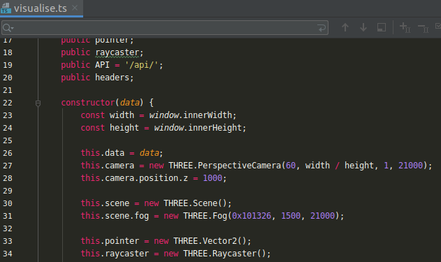

## Nerijus  CV

---

#### Nuoroda: https://artme.weedkauskas.lt

---

## Filosofija:

Rašyti kodą taip, kad jis būtų lengviau prižiūrimas. 

Rašyti taip, kad jį galima būtų extendinti pridedant naujo funkcionalumo ateityje, kažko nesulaužant. 

Rašyti kodą taip, kas jis būtų lengvai skaitomas ir aiškiai matytusi kas ką daro.

---

## S-O-L-I-D

Tvirtas kodas, kad atlaikytų laiko išbandymą. 

---

#### S - Single responsibility principle
Klasė turi būti atsakinga tik už vieną dalyką. 

#### O - Open/Closed principle
Atviras išplėtimui - uždaras modifikacijoms. Išplėskime funkcionalumą pridėdami naują kodą vietoj esamo kodo keitimo. 

Tikslas: pasiekite tašką, kai niekada negalėsime sulaužyti sistemos branduolio.

#### L - Liskov principle
Liskov pakeitimo principas. Klasės turi galėti būti sukeičiamos. Pvz. turėdami dvi klases apliekančias tą pačią užduotį ir implementuojančias tą patį interfeisą, turime turėti galimybę jas sukeisti viena su kita, nesugriaunant aplikacijos.
#### I - Interface segregation principle
Interfeisų atskyrimo principas. Klientas niekada neturėtų būti verčiamas priklausyti nuo metodų, kurių jis nenaudoja.
#### D - Dependency inversion principle
Nepriklausyti nuo kažko konkretaus, tik nuo abstrakcijų. Mūsų kodas turėtų priklausyti nuo dalykų tipų, o ne nuo pačių konkrečių dalykų.
Aukšto lygio moduliai neturėtų priklausyti nuo žemo lygio modulių. Abu turėtų priklauso nuo abstrakcijų.

"Injekcija". Fundamentaliai paprastas konceptas, plačiai naudojamas, jog atrodo ir pavadinimo tam nereikia. 

Tai paprasčiausiai reiškia, kad užuot patys kurę klasių objektus, paminime juos funkcijų argumentuose ir kažkas automatiškai juos sukurs. Šis „kažkas“ Laravel pasaulyje yra Service Container.

---

## Dependency injection Laravel'yje

Susiejam interface'ą

P.S. Naudojame sukurtus app/Service, kad Controller'is būtų švarus. Yra galimybė sukeisti, nes jie taip pat priklauso nuo interface'o.

---

## Singleton pattern

Panašiai kaip bind, tik kraunam instance tik vieną kartą globaliai request'ui.

``$this->app()->singleton(...``

## Provider pattern
Galimybė išplėsti framework'ą užregistruojant service provider ``app.php``

## Facade pattern

Fasadai suteikia „statinę“ sąsają klasėms. Plačiai naudojama laravel by default.

Kaip sukurti custom fasadą:

Laravelyje naudojama labai plačiai, yra daug default'inių Facades
    
## Repository pattern

Paprastai tariant Repository pattern laravelyje yra papildomas sluoksnis tarp Modelio ir Conrollerio. Šios aplikacijos atveju tarp Modelio ir Service. Nice to have, ypač didesniems projektams, kada reiktų keisti duomenų šaltinius.

## Requests validacija
Validaciją taip pat iškeliame iš Controller, kad jis būtų švarus ir darytų tik tai, ką privalo, taip nelaužant SOLID principų. Vietoje Request naudojam Custom requestus užkraudami dependency injekcijomis.

## Traits
Naudojamas, kai norime, kad dvi klasės ar daugiau, elgtusi panašiai.
Pvz Laravel modeliuose: 

Žinoma galime kurtis ir custom Traits

## Queues

Kuriam queueable job``php artisan make:job JobTitle``

Leidžiam darbą 

## Task Scheduling

Įvairius darbus galime vykdyti, kada tik norime.

---

Kiti naudojami patternai ir ne tik anglu kalba demo app'se.

Observer pattern, Factory design pattern, Builder/Manager pattern, Strategy pattern ir t.t.

---
## Backend
Tik Proof Of Concept. Tikromis veikimo sąlygimis turėtų būti autentifikacija, galbūt rolės ir permission'ai, email patvirtinimas ir t.t.

## Frontend
Panaudojau webpack, three.js, bootstrap 5 subuildintą tik ir naudojamų modulių, css buildinam iš scss, blade template'us. 

Iš esmės yra daug skirtingų pasirinkimų ant ko galėtų būti parašytas frontend. 
Galima naudoti stiliui tailwind.css, JS daliai React ar Vue, daryti mobile app su React-native, tiesiog naudojant api routes ir t.t. ir t.t.

P.S. three.js irgi turi pritaikymą React'ui pavadinimu "react-three-fiber".

3D cool stuff :) 

resources/scss/...

``npm install``
``npm run build``
``npm run scss``

---

## KISS - keep it simple stupid :) 

---

## Setup
Gana defaultinis Laravel setupas, darom viską įprastai.

.env.example pervadinam į .env bei susivedam DB duomenis

Pakopijuojant dar kart ir užvardinam .env.testing bei suvedam kitą testinę DB_DATABASE, kuri bus naudojama testams.

Migruojam

``php artisan migrate:fresh --seed``

``php artisan migrate:fresh --env=testing``

Pasileidžiam eilę
``php artisan queue:work --tries=3``

Taip pat schedulinimą, kad gautume mėnesines prenumeratas, galime paleisti pvz ir per cron'ą Linux mašinoje.

``* * * * * cd /path-to-appv && php artisan schedule:run >> /dev/null 2>&1``

Ar dar geriau su Supervisor.

---

## Testing

Bonus: Parašyti Feature ir Unit testai. Sulaužyti ką nors nepastebėjus ypač sunku.

``php artisan test`` 

